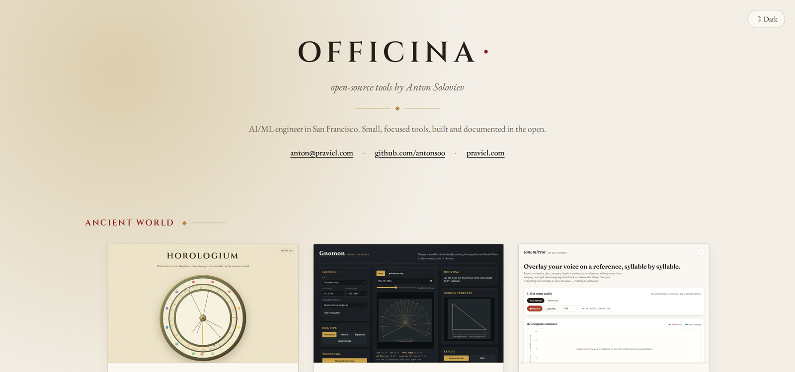

# officina

**An index of open-source tools by Anton Soloviev.**

[](LICENSE)
[](https://antonsoo.github.io/officina/)

A single static page that lists every published tool in one place - built
so there is one link to share on Upwork or with a client instead of a
dozen. Officina is Latin for workshop.



## Live demo

**[antonsoo.github.io/officina](https://antonsoo.github.io/officina/)**

## How it works

Every entry lives in [`public/projects.json`](public/projects.json): name,
one-line description, audience group, repo URL, live-demo URL (or `null`
for a CLI-only tool), a thumbnail path, and a `status` of `published` or
`soon`. `soon` entries are fetched with everything else but not rendered,
so a project can be added to the data ahead of its public launch and
switched on later by flipping one field. Adding a project is one JSON
entry and one image - no other file changes.

Thumbnails are 1200x750 WebP, produced by [`scripts/make_thumb.py`](scripts/make_thumb.py):
either a fresh screenshot of the live demo (`shot.mjs ... --width 1200
--height 750 --scale 1`) or a cover-fit crop of a CLI-only project's own
README hero image, compressed to stay under about 200 KB each.

The page itself is a single TypeScript module (`src/main.ts`) that fetches
the JSON, groups by audience, and renders the cards - no framework, no
router, no build-time templating.

## Quickstart

```bash
git clone https://github.com/antonsoo/officina && cd officina
npm install
npm run dev
```

## Development

```bash
npm ci
npm run typecheck
npm run lint
npm run build      # -> dist/, base '/officina/'
```

## Design

Imperial Roman: a parchment ground, a crimson accent, gold hairlines,
[Cinzel](https://fonts.google.com/specimen/Cinzel) for the wordmark and
project names, [EB Garamond](https://fonts.google.com/specimen/EB+Garamond)
for everything read at length. Light and dark themes follow the system
preference, with a manual toggle persisted in `localStorage`. No
tracking, no analytics, no external requests beyond the two Google Fonts
stylesheets.

## Contributing

See [CONTRIBUTING.md](CONTRIBUTING.md).

## License

[MIT](LICENSE) (c) 2026 Anton Soloviev
